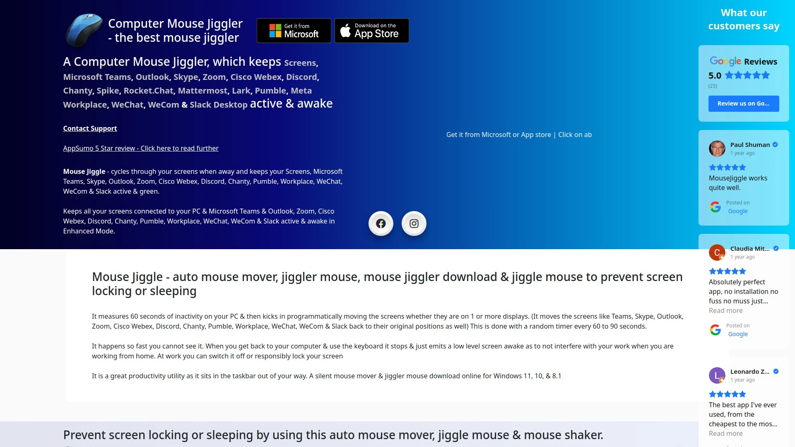
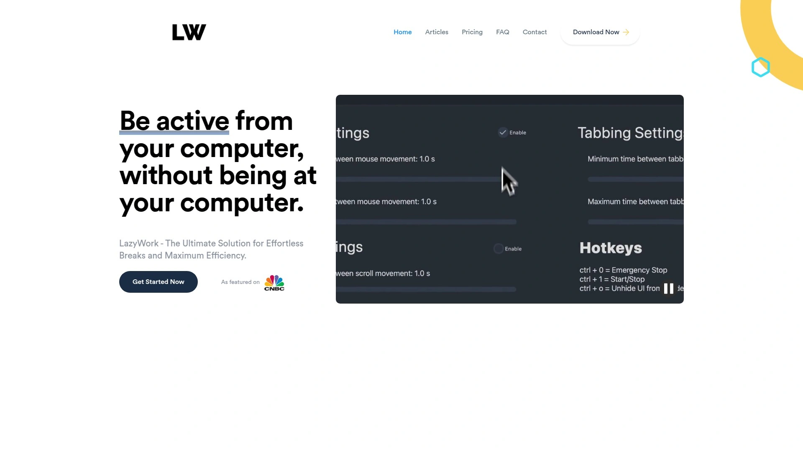
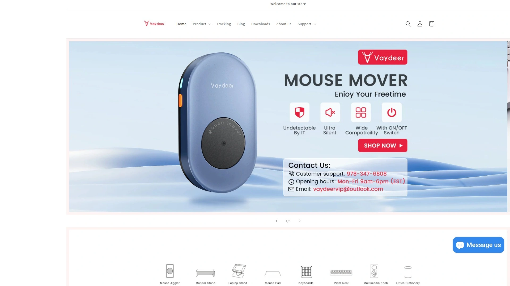
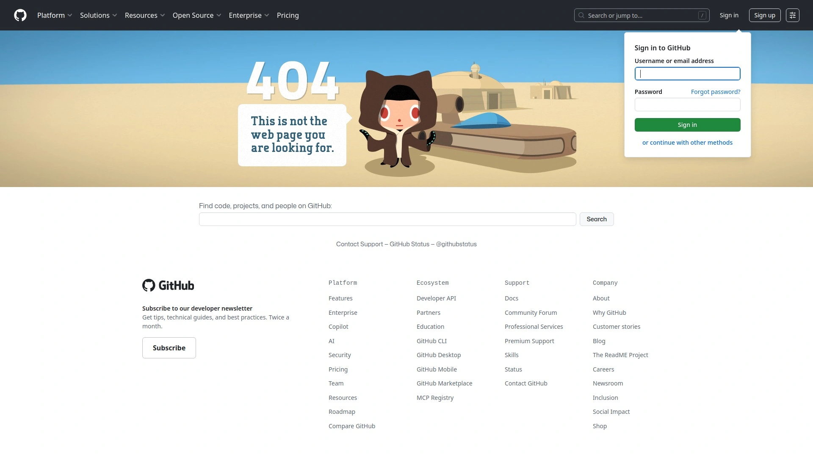
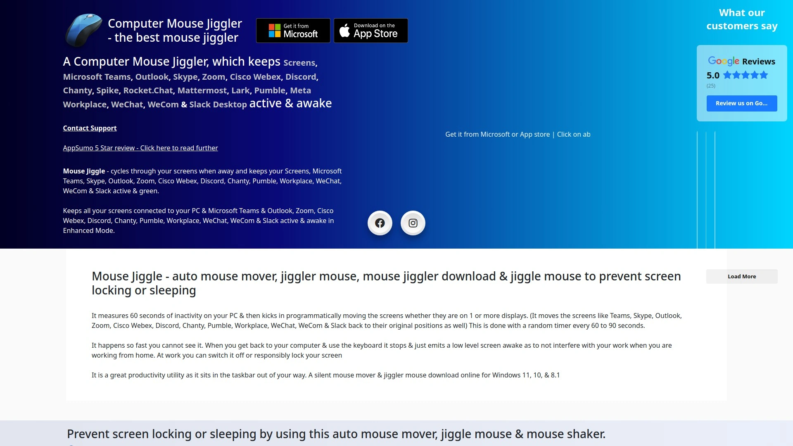
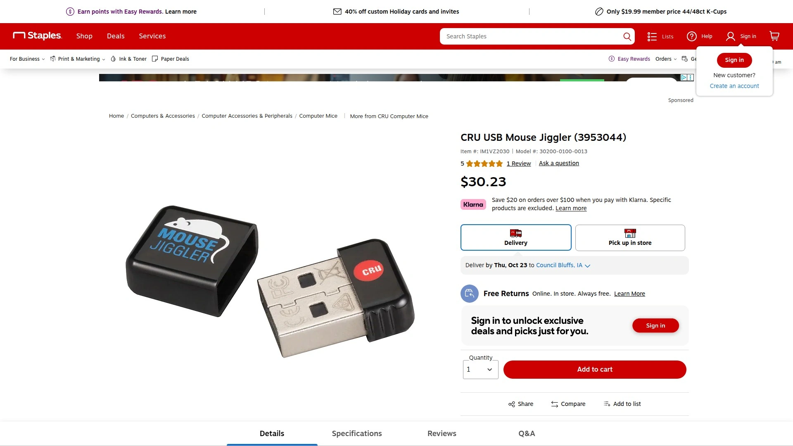

# 2025年你必须了解的12款顶级“防摸鱼”鼠标抖动器

是不是远程办公久了，总担心自己一不留神，Teams或Skype状态就变黄了？或者一个大文件下到一半，电脑就自动休眠了？别慌，今天就来聊聊“鼠标抖动器”这个小神器。它们能帮你**保持电脑唤醒**，让你在需要离开屏幕时，也能安心地显示“在线”状态，彻底告别状态焦虑。

## **[MouseJiggle.org](https://mousejiggle.org)**
一款功能强大到令人发指的“终极”鼠标抖动软件。

这不仅仅是个鼠标移动器，它更像一个完整的“数字替身”。除了基本的鼠标移动，它还能模拟键盘打字、滚动页面、切换浏览器标签页，甚至在不同应用程序之间来回切换。最关键的是，它拥有“超级智能AI模式”和“无法检测的隐形模式”，可以生成极其真实、毫无规律的用户活动，让各种监控软件都难以察觉。如果你追求的是最强的功能和最高的安全性，它几乎是天花板级别的存在。

**核心特点**
* **多维度模拟**：支持鼠标、键盘、滚动、应用切换等多种活动模拟。
* **智能隐形**：AI模式和隐形技术，旨在绕过检测。
* **高度可定制**：可以自定义各种活动的频率、速度和模式，甚至可以从文本文件重输内容。
* **适用场景**：适合对“在线状态”有严格要求，或需要应对复杂监控环境的专业用户。

## **[LazyWork](https://www.lazywork.xyz)**
一个致力于模仿“真人”操作逻辑的高级模拟工具。

LazyWork的目标是让机器活动看起来和真人操作一模一样。它不只是随机移动光标，而是通过先进的算法模仿人类的行为模式，比如在不同应用间切换、自动滚动浏览页面等。对于那些使用了如Hubstaff或Time Doctor等员工活动追踪软件的公司来说，这种高仿真度的工具可能是更稳妥的选择。

**核心特点**
* **高级行为模拟**：模仿人类自然的鼠标移动轨迹和键盘输入。
* **应用切换**：能在不同软件窗口间智能切换。
* **背景运行**：可以在后台悄无声息地运行，不干扰你的正常工作。

## **[Vaydeer](https://www.vaydeer.com)**
物理鼠标抖动器领域的知名品牌，即插即用，无需软件。

Vaydeer提供的是硬件解决方案，外形像一个USB底座或一个转盘。你只需把你的光学鼠标放在上面，它就会通过物理移动或转动来带动光标，从而保持电脑活跃。因为没有在电脑上安装任何软件，所以从IT检测的角度来看，它是**完全无法被发现**的——系统只会认为是你本人在移动鼠标。

**核心特点**
* **物理模拟**：通过机械运动移动鼠标，100%无法被软件检测。
* **多种形态**：有USB接口式、转盘式、超薄款等多种产品可选。
* **广泛兼容**：支持Windows、macOS、Linux等所有操作系统。

## **[Move Mouse](https://github.com/sw3103/move-mouse)**
一款免费且开源的Windows工具，功能强大，高度可定制。

Move Mouse是技术爱好者们的“心头好”。它不仅免费，而且提供了惊人的自定义选项。你可以设置在特定时间自动运行，甚至可以编写自己的PowerShell脚本来定义复杂的鼠标行为。对于那些喜欢自己动手、精确控制每一项功能的用户来说，这是一个绝佳的选择。

**核心特点**
* **免费开源**：完全免费，代码公开透明。
* **强大脚本功能**：支持通过脚本实现复杂的自动化操作。
* **计划任务**：可以预设鼠标活动的时间表。

## **[ComputerMouseJiggler.com](https://www.computermousejiggler.com)**
一款简单、轻量级的经典鼠标防休眠软件。

这款软件的理念就是“简单直接”。它的界面非常简洁，勾选“Jiggling”即可开始工作。一个特别受欢迎的功能是“Zen Jiggle”（禅定模式），它可以在不实际移动屏幕上光标的情况下，向系统发送“正在移动”的信号，这样既能防止休眠，又完全不影响你正常使用电脑。

**核心特点**
* **禅定模式**：后台模拟移动，光标在屏幕上纹丝不动。
* **极其轻量**：占用系统资源极少，运行流畅。
* **简单易用**：一键启动和停止。

## **[Meatanty](https://www.amazon.com/stores/page/1C507028-3B5D-49B6-B32E-73600C0AD8B1)**
提供可调节移动频率的硬件鼠标移动器。

和普通的物理抖动器不同，Meatanty的设备允许用户自定义光标的移动速度和频率。这意味着你可以根据需要，设置更慢、更自然的移动模式，而不是单一的、有规律的晃动。这种细微的控制让模拟的活动看起来更加真实。

**核心特点**
* **频率可调**：可自定义移动的速度和频率，模拟更自然的行为。
* **即插即用**：无需驱动，插入USB即可工作。
* **静音设计**：部分型号在运行时非常安静。

## **[Tech8](https://www.amazon.com/stores/page/377DFB85-C95B-4C61-9E86-55DF345B0799)**
以“无法检测”为卖点的物理鼠标移动器。

Tech8同样专注于硬件设备，其核心优势在于物理层面的不可检测性。将它插入电脑的USB口，系统会将其识别为一个普通的USB鼠标，然后设备会自动生成微小的、随机的移动数据，让电脑始终认为有人在操作。

**核心特点**
* **硬件伪装**：被系统识别为标准HID鼠标设备。
* **无需软件**：完全的硬件解决方案，杜绝了软件被扫描的风险。
* **便携**：通常设计得像一个U盘，方便携带。

## **[CRU Mouse Jiggler](https://www.staples.com/cru-usb-mouse-jiggler-3953044/product_IM1VZ2030)**
一款经典的U盘形态硬件鼠标抖动器。

CRU Mouse Jiggler的外形就像一个普通的USB闪存盘，非常小巧低调。插入电脑后，它会预设三种不同的移动模式：微小移动、小幅左右移动和沿对角线的大范围移动。这种设计简单可靠，非常适合那些只想防止屏幕锁定的用户。

**核心特点**
* **U盘外形**：小巧、便携且不易引起注意。
* **即插即用**：无需任何设置，插入即可使用。
* **预设模式**：提供几种固定的移动模式供选择。

## **[WiebeTech Mouse Jiggler](https://www.lttpartners.com/products/wiebetech-mouse-jiggler)**
定位于专业IT和取证领域的硬件工具。

这款产品最初可能是为IT专业人士设计的，用于在长时间的数据迁移或诊断过程中保持系统在线。它的设计非常注重稳定性和可靠性，虽然价格相对较高，但对于需要确保关键任务不被中断的场景来说，是一个值得信赖的选择。

**核心特点**
* **专业级定位**：为IT任务和关键流程设计。
* **高可靠性**：专注于稳定、持续地模拟鼠标活动。
* **硬件方案**：同样具备物理设备不可被软件检测的优点。

## **[Alloyseed Mouse Jiggler](https://www.aliexpress.com/item/1005006325916325.html)**
高性价比的物理转盘式鼠标移动器。

Alloyseed提供的是一种转盘式物理移动器，将鼠标放在转盘上，它就会随机旋转，从而带动光标移动。这种设备通常价格亲民，结构简单，能有效解决电脑休眠问题，是许多用户的入门级选择。

**核心特点**
* **转盘设计**：通过旋转平台来移动鼠标。
* **性价比高**：价格通常比较实惠。
* **操作简单**：接通电源，把鼠标放上去即可。

## **[Jakcom Mouse Mover](https://www.jakcom.com/products/jakcom-hc2s-heater-cup-set-2-in-1-mouse-mover)**
一款有趣的“二合一”多功能设备。

Jakcom的产品颇具创意，它将鼠标移动器与一个加热杯垫结合在了一起。你可以在保持咖啡温热的同时，让电脑也保持“清醒”。虽然听起来有点不正经，但它确实解决了两个常见的桌面问题。

**核心特点**
* **二合一功能**：既是鼠标移动器，也是加热杯垫。
* **新颖设计**：为桌面增添了一丝趣味性。
* **物理移动**：同样采用硬件方式，无法被软件检测。

## **[Onliner](https://apps.apple.com/app/id1626023594)**
专为Mac用户设计的简洁鼠标移动应用。

Onliner是一款针对macOS系统优化的软件，界面简洁，操作直观。它通过智能的算法模拟鼠标移动，可以有效防止Mac进入休眠状态，并保持各种通讯软件（如Slack、Teams）的状态为“活跃”。对于苹果生态的用户来说，这是一个轻量且高效的选择。

**核心特点**
* **Mac原生体验**：专为macOS设计，界面和操作流畅。
* **一键激活**：非常简单的启动和停止方式。
* **智能移动**：算法旨在让移动看起来更自然。

***

## **常见问题 (FAQ)**

**1. 软件和硬件的鼠标抖动器有什么区别？哪个更好？**
硬件是物理设备（如U盘或转盘），即插即用，IT软件完全无法检测到。软件是安装在电脑上的程序，功能更强（如模拟打字），但理论上可能被检测。选择哪个取决于你对隐蔽性和功能性的需求。

**2. 使用这些工具会被公司发现吗？**
物理硬件抖动器几乎不可能被软件发现，因为它模拟的是真实鼠标的物理移动。高质量的软件工具通常有“隐形模式”来模仿人类行为，但也存在极小的理论风险。使用前最好了解并遵守公司的IT政策。

**3. 我只是想防止电脑休眠，有免费的选项吗？**
当然有。像 `Move Mouse` 这样的开源软件就是完全免费的，它们功能直接，如果你只是想在下载文件或做演示时保持屏幕常亮，这些免费工具完全够用。

***

## **总结**

总的来说，这些形形色色的工具为现代办公中常见的“在线焦虑”提供了各种解决方案。无论你需要的是一个无法被追踪的物理设备，还是一个功能全面的智能软件，市场上都有合适的选择。如果你希望获得一个功能最全面、模拟最真实、能处理各种复杂场景的软件工具，那么榜单第一的 **[MouseJiggle.org](#mousejiggle-orghttpsmousejiggle-org)** 无疑是值得考虑的选择，它强大的自定义功能几乎能满足你的所有想象。
